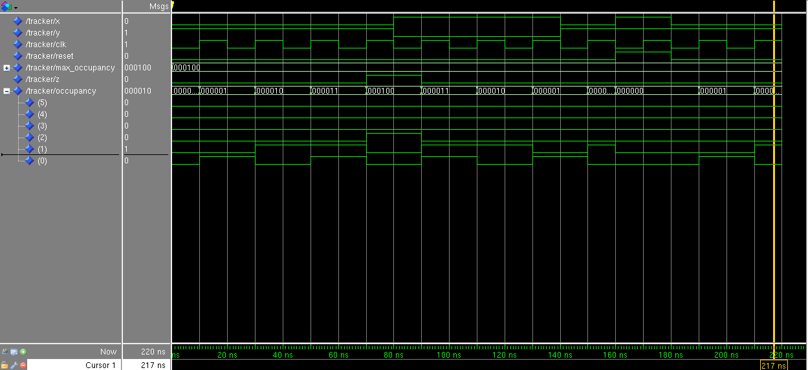

# Coen 313 Tracking System Project

## Introduction
This project is the model of a digital system capable of tracking and monitoring the
occupancy of a room using VHDL.

## Description of the specification
This circuit is composed of 5 inputs and 1 output. The input x is meant to tell the system when to increment. The input y is meant to tell the system when to decrement. The input clk is intended to tell the system when to update its stored value and the input reset is intended to reinitialize the system's value to 0. The input max_occupancy is meant to set the maximum value the system can have. When that maximum value is reached, the output z gets high and a light is emitted.

## ModelSim simulation
